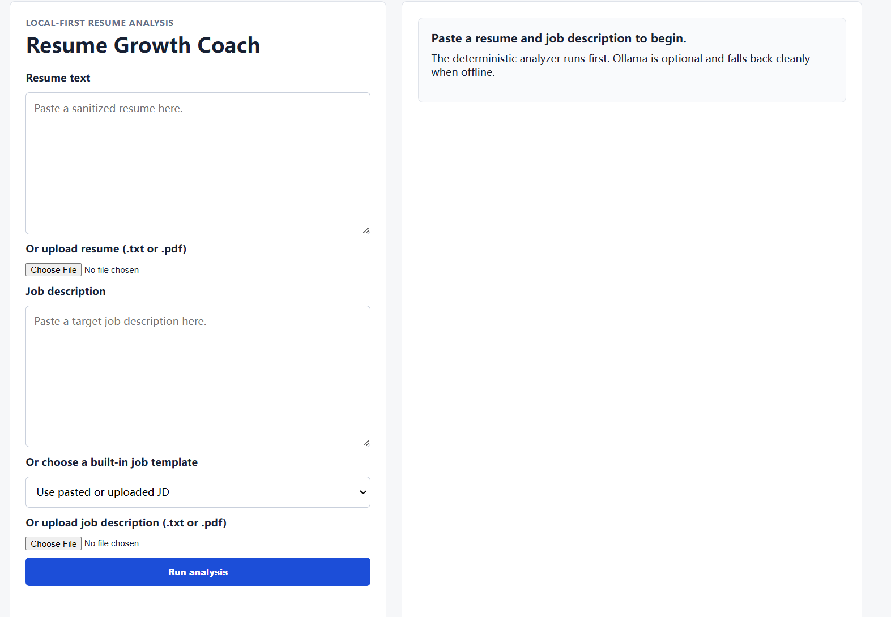
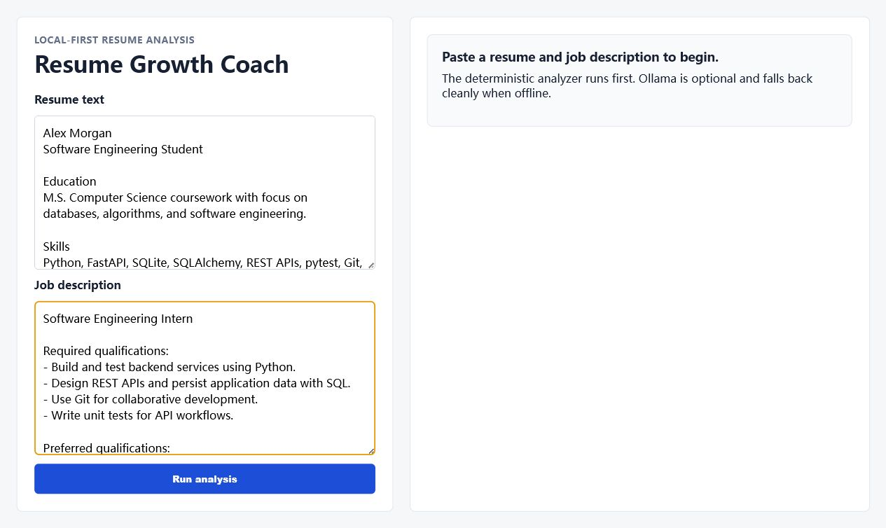
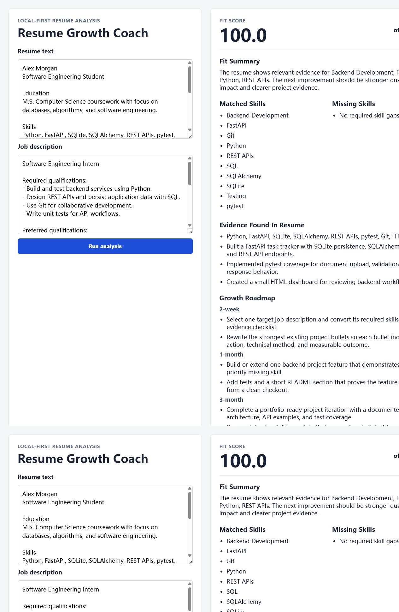
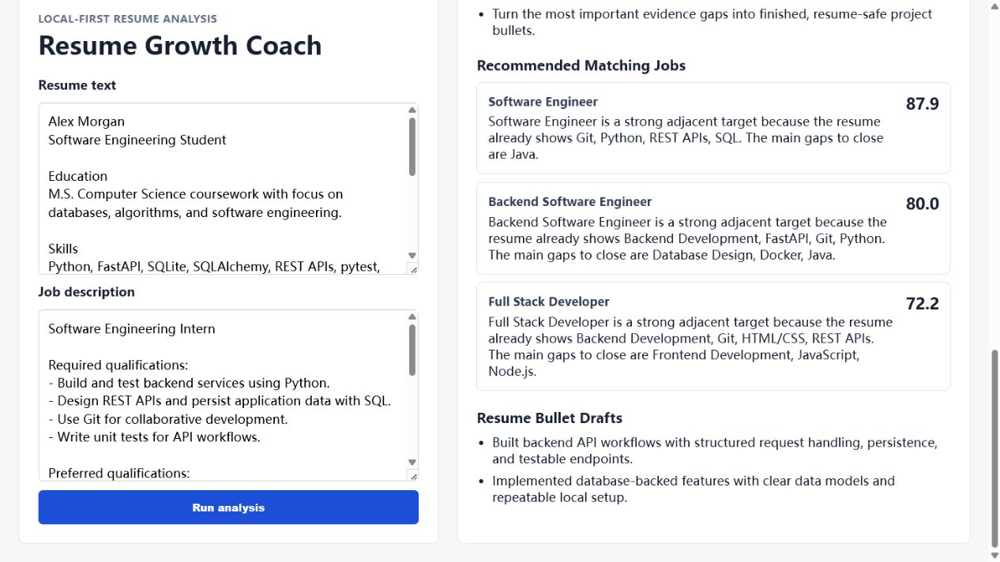

# Resume Growth Coach

Resume Growth Coach is a local-first AI backend project that compares a resume with a target job description, identifies skill and evidence gaps, and produces a practical growth roadmap.

The project runs deterministic analysis before any LLM generation. Ollama is optional: when it is offline, the app still returns a fit score, matched skills, missing skills, project evidence, and fallback goals.

## Features

- FastAPI backend with JSON APIs and a local HTML UI
- SQLite persistence through SQLAlchemy
- Pasted text and `.txt` / `.pdf` document input
- Deterministic skill matching and explainable fit scoring
- Evidence-aware fit scoring that distinguishes listed skills from project evidence
- Optional Ollama summaries with offline fallback
- Growth goals for 2-week, 1-month, and 3-month horizons
- pytest coverage for parsing, matching, API flow, and fallback behavior

## Quick Start

Create and activate a virtual environment, then install dependencies:

```powershell
python -m venv .venv
.\.venv\Scripts\Activate.ps1
python -m pip install -r requirements.txt
```

After setup, launch the app with the one-click helper from the project root:

```powershell
.\Start-ResumeGrowthCoach.ps1
```

You can also double-click:

```text
Start-ResumeGrowthCoach.cmd
```

Both launchers start the FastAPI server and open the local web page automatically.
They also start the Ollama API if needed and verify that `qwen2.5:3b` is installed before opening the page.

Manual run command:

```powershell
.\.venv\Scripts\python.exe -m uvicorn app.main:app --reload
```

Open:

```text
http://127.0.0.1:8000
```

Run tests:

```powershell
pytest
```

Run the reusable adversarial quality gate:

```powershell
.\scripts\run-quality-gate.ps1
```

The quality gate runs the regression suite and API contract checks using a temporary SQLite database and a fake LLM response. It does not require Ollama and does not modify the local application database.

## User Interface Walkthrough

The screenshots below use sanitized template data only. They do not include a real person's name, contact information, resume, or job application details.

### Start Screen

Paste a sanitized resume and a target job description into the two input boxes.



### Template Input

The left panel keeps the submitted resume and job description visible so the user can verify what was analyzed.



### Analysis Results

The right panel shows the deterministic fit score, the Ollama status and model name, matched skills, missing skills, evidence, roadmap, recommended jobs, and resume bullet drafts.



### Matching Job Recommendations

The app also recommends the top matching job directions for the resume, with a score and a short reason for each option.



## Optional Ollama Setup

Install Ollama and pull the default model:

```powershell
ollama pull qwen2.5:3b
```

If Ollama is not running, the application still returns deterministic analysis.
The default local-model request timeout is 60 seconds. Override it when needed with `RGC_OLLAMA_TIMEOUT_SECONDS`.

## API Overview

- `POST /api/documents/resume`
- `POST /api/documents/job-description`
- `POST /api/analyses`
- `GET /api/analyses/{analysis_id}`
- `GET /api/goals/{analysis_id}`

## Privacy Notes

Do not commit real resumes, real job descriptions, local databases, upload folders, or `.env` files. Use only sanitized sample data in public repositories.

## Sample Resume Bullets

These bullets should only be used after the matching implementation, persistence, UI, and tests are verified:

- Built a local-first AI resume growth coach with FastAPI, SQLite, SQLAlchemy, and Ollama to compare resumes against job descriptions.
- Implemented deterministic skill matching and gap scoring before LLM generation, reducing dependence on prompt-only analysis.
- Added PDF/text parsing, persisted analysis history, and generated 2-week, 1-month, and 3-month self-improvement roadmaps.
- Tested document upload, analysis, and offline LLM fallback flows with pytest and FastAPI TestClient.
